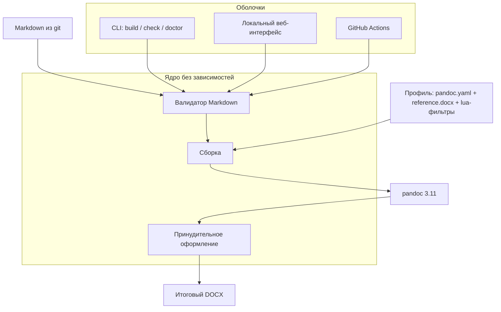

# План развития md2gostdocx

Документ описывает, как из нынешнего скрипта на 160 строк сделать локальный
инструмент docs-as-code, который распространяется публичным репозиторием,
работает на macOS и Windows и не отправляет документы никуда.

Всё, что помечено как проверенное, проверено запуском команд на этой машине
6 сентября 2026 года: pandoc 3.11, Python 3.12.0, Node 20.20.2, macOS 26.6 ARM.
Утверждения, которые проверить было нечем, помечены явно — им верить нельзя,
пока не проверите сами.

> [!IMPORTANT]
> Этот файл написан на том самом диалекте Markdown, который предлагается ниже.
> Он одновременно план и приёмочный образец: если инструмент соберёт из него
> приличный DOCX, значит этап работает.

## 1 Что есть сейчас

| Компонент | Состояние |
|---|---|
| `artifacts/md_to_docx_gui.py` | 160 строк, Tkinter; GUI, вызов pandoc и обработка ошибок слиты в один класс |
| `artifacts/startmydocx.command` | Запуск двойным щелчком, только macOS |
| `artifacts/reference.docx` | Шаблон стилей, требует ремонта (см. ниже) |
| `docs/TZ_md2gostdocx.md` | ТЗ на 666 строк, 4 этапа, 15 приёмочных критериев |

Против ТЗ это примерно 40 % первого этапа. Нет профилей, нет постобработки,
нет валидатора, нет журнала, нет кросс-платформенности.

Три места в текущем коде ломаются вне macOS — проверено чтением исходника:

| Строка | Проблема | Замена |
|---|---|---|
| 11 | `"/opt/homebrew/bin/pandoc"` как фолбэк | поиск в PATH + переменная окружения |
| 151 | `subprocess.run(["open", ...])` | `os.startfile` / `open` / `xdg-open` по платформе |
| 133 | `subprocess.run(..., text=True)` без `encoding` | `encoding="utf-8"`, иначе на русской Windows stderr pandoc приходит кракозябрами |

## 2 Находки, которые меняют ТЗ

Это главный раздел. Пять требований ТЗ основаны на неверных предположениях о
том, как работает pandoc. Их надо переписать, иначе они не будут выполнены
ни на каком этапе.

### 2.1 Конструкция из §5.7 не делает ничего

ТЗ предлагает задавать стиль таблицы обёрткой `::: {custom-style="RequirementsTable"}`.
Проверено: стиль применяется только к абзацам, таблица получает дефолтный
`<w:tblStyle w:val="Table"/>`, а абзацы в ячейках — `Compact`. Стиль таблицы
можно поставить **только** lua-фильтром, выставляющим атрибут на элемент `Table`.

Отдельная ловушка: для абзацных стилей pandoc молча создаёт заглушку в
`styles.xml`, если стиля нет в reference. Для стилей таблиц — **не создаёт**.
Ссылка на несуществующий `tblStyle` даёт в Word таблицу вообще без границ.

### 2.2 Атрибут `{width=90%}` из §4.6 почти всегда бесполезен

Проверено на реальных картинках: процент действует только как ограничение
сверху для изображений **шире** полосы набора. Картинка 300×200 при `90%`,
`200%` и без атрибута даёт одинаковый `wp:extent 3810000×2540000`.

Зато крупные изображения pandoc сам вписывает в полосу набора, читая `pgSz` и
`pgMar` из reference.docx. Требование «вписывать в рабочую ширину» выполняется
само — при условии, что в reference.docx есть корректный `sectPr`.

Практическое правило для авторов: экспортировать PNG шириной от 2000 px и
ничего в Markdown не писать. На GitHub `{width=90%}` виден как мусорный текст.

### 2.3 Причина «сжатых таблиц» — не автоподбор

Для gfm-таблиц pandoc пишет `<w:tblW w:type="auto" w:w="0"/>`, а `tblGrid`
всегда в сумме 7920 twips (5,5 дюйма) независимо от размера страницы.

Но вывод «лечится только постобработкой» **неверен**, он был опровергнут
проверкой. Lua-фильтр в четыре строки, выставляющий `colspecs` с суммой 1.0,
заставляет pandoc написать `tblW pct=5000` + `tblLayout fixed` + пропорциональные
`gridCol`:

```lua
function Table(t)
  local n = #t.colspecs
  for i = 1, n do t.colspecs[i] = { t.colspecs[i][1], 1.0 / n } end
  return t
end
```

Проверено: даёт 100 % ширины и на дефолтном reference, и на пользовательском,
причём пропорции колонок можно задавать произвольные.

Границы, отступы ячеек, вертикальное выравнивание и жирную шапку тоже проверили —
они прекрасно живут в **стиле таблицы** внутри reference.docx (через `tblStylePr
firstRow`). Проверка: вставили `w:tblBorders` в стиль `Table`, прогнали pandoc,
получили границы при нуле прямых `tblBorders` в `document.xml`.

Отсюда разделение труда, которое экономит несколько сотен строк кода:

| Что | Где делается | Почему |
|---|---|---|
| Ширина таблицы 100 % | lua-фильтр `colspecs` | pandoc ставит прямое форматирование, стиль его не перебьёт |
| Границы 0,5 pt, отступы, `vAlign` | стиль таблицы в reference.docx | ревьюабельно, не ломает схему OOXML |
| Жирная шапка по центру | `tblStylePr firstRow` в reference.docx | то же |
| Шрифт и кегль | `docDefaults` + `Normal` в reference.docx | одна точка правды на весь пакет |
| Принудительный режим (§6.2) | тонкий post-processing | страховка для чужого reference.docx |

Постобработка при этом сжимается с шестидесяти строк до трёх-четырёх — и вместе
с ней исчезает половина граблей: порядок элементов в `tblPr`, дубли `tcPr`,
идемпотентность, ломка zip.

### 2.4 reference.docx требует ремонта, а не замены

Первое исследование объявило его «немодифицированным дефолтом pandoc» — это
опровергнуто проверкой. Реально это производный документ: `document.xml` на
413 КБ, два колонтитула, `customXML`, 107 стилей против 49 у дефолта, уже
настроены кегль 12 pt, выравнивание по ширине, интерлиньяж 276, номер страницы
в колонтитуле, `titlePg`.

Чего в нём нет:

- **A4.** Стоит `pgSz w=12240 h=15840` — это US Letter. §6.1 ТЗ не выполняется
  на уровне шаблона, и вся арифметика ширины таблиц считается от неверной полосы.
- **Times New Roman на уровне стилей.** Задан только у `Heading2`. Шаблон
  выглядит правильным лишь потому, что в его собственном теле 497 прогонов несут
  прямое форматирование на уровне run — а такое форматирование pandoc не
  воспроизводит никогда.
- Стилей `Requirement`, `Note`, `Warning` и стилей таблиц.
- `docDefaults` задаёт `w:lang="en"` — Word подчёркивает весь русский текст
  как ошибки.

Работа с ним — отдельная задача на полдня в самом Word, а не в коде.

### 2.5 Кириллица берётся из `w:hAnsi`, а не из `w:ascii`

По спецификации MS-OI29500 §17.3.2.26 диапазон U+0400–04FF резолвится через
атрибут `w:hAnsi`. Классическая ошибка — поставить `w:ascii="Times New Roman"`
и получить латиницу в Times, а русский текст в прежнем шрифте. Ставить надо все
четыре атрибута: `ascii`, `hAnsi`, `cs`, `eastAsia`.

Вторая половина ловушки: атрибуты `*Theme` (`asciiTheme` и прочие) перебивают
обычные. Встроенный reference pandoc содержит именно их, и тема разрешается в
Aptos. Дописать `w:ascii` рядом с `w:asciiTheme` — не сработает.

### 2.6 Прочее, что стоит знать до начала работ

| Факт | Следствие |
|---|---|
| `--standalone` для docx — no-op | убрать из команды, он создаёт ложное чувство настройки |
| `+attributes` молча съедает `{.foo}` и `{k=v}` в прозе | никогда не включать: в ТЗ это тихая потеря текста |
| `+smart` даёт английские кавычки и en-dash | не включать, кавычки « » набирать руками |
| `--number-sections` + ручные номера = двойная нумерация | выбрать одно; сейчас номера в Markdown |
| Отсутствующая картинка не роняет сборку | нужен `--fail-if-warnings`, иначе рисунок молча исчезает |
| Ключ defaults-файла — `filters:`, а не `lua-filter:` | второй даёт `exit 64` |
| `> [!NOTE]` парсится pandoc нативно | это GitHub-безопасная замена fenced divs |
| Неизвестные YAML-поля уезжают в `docProps/custom.xml` | `document_code` и `customer` доступны для §4.2 — и это канал утечки метаданных |
| Заголовок «# 1 Общие сведения» даёт закладку-хэш `X<sha>` | внутренние ссылки работают, внешние на якорь — нет |
| `--toc` даёт **пустое** поле TOC | Word заполнит при открытии, LibreOffice может показать пусто |
| Mermaid без рендера попадает в DOCX текстом `flowchart TD …` | прямое нарушение §4.7 |
| Сборка реального ТЗ — 0,9 с, 30 КБ на выходе | производительность не проблема |

## 3 Целевая архитектура

Один шов: ядро, работающее со строками и байтами и не знающее ни одного пути
пользователя, плюс тонкие адаптеры вокруг него.



Проверено на прототипе: CLI, установленный через `uv tool install` бинарь и
HTTP-обработчик отдают **байт-идентичный** DOCX (sha256 `8df8609029f9b57d…`).
Это и есть доказательство, что шов проведён в правильном месте.

Структура пакета:

```text
md2gostdocx/
├── pyproject.toml
├── src/md2gostdocx/
│   ├── models.py          # Profile, BuildRequest, BuildResult, Diagnostic
│   ├── validate.py        # чистая функция, ноль I/O
│   ├── core.py            # build(req) -> BuildResult
│   ├── postprocess.py     # zipfile + ElementTree, только stdlib
│   ├── platform.py        # поиск pandoc, открытие файла и папки
│   ├── profiles/gost19/
│   │   ├── pandoc.yaml    # --defaults: from, reference-doc, filters, toc
│   │   ├── profile.json   # правила принудительного оформления
│   │   ├── reference.docx
│   │   └── filters/*.lua
│   ├── cli.py
│   └── web/               # FastAPI + собранная статика
├── examples/example-tz.md
└── tests/
```

Ядро — на стандартной библиотеке. `python-docx` не нужен: в OpenXML лезть всё
равно придётся, а установка получается 252 КБ вместо 125 МБ. Держать его стоит
только в dev-зависимостях, и то с оговоркой: проверено, что он открывает без
единой жалобы документ с трижды нарушенным порядком элементов `tblPr`, то есть
как оракул валидности почти бесполезен.

## 4 Диалект Markdown

Требование §8.4 — исходник должен нормально выглядеть на GitHub. Проверено,
что именно его ломает.

**Разрешено:** YAML-фронтматтер; заголовки `#`, `##`, `###`; `**`, `*`, `~~`;
списки; GFM-таблицы; ссылки; сноски; чек-листы; алерты `> [!NOTE]`,
`> [!WARNING]`, `> [!IMPORTANT]`; картинки ``;
подпись таблицы отдельным абзацем `**Таблица — Название**` непосредственно перед
таблицей; блоки ` ```mermaid `; семантические блоки как `<div class="requirement">`
с пустыми строками вокруг — на GitHub теги скрываются, а lua-фильтр превращает
их в стиль Word.

**Запрещено:** `::: {custom-style=…}`, `[x]{custom-style=…}`, `{width=…}`,
grid-таблицы, `Table: caption`, ручные `--` и `"…"` вместо « » и —.

Команда сборки целиком:

```bash
pandoc "<src.md>" \
  --from=gfm --to=docx \
  --reference-doc="<profile>/reference.docx" \
  --resource-path="<каталог исходника>" \
  --lua-filter=filters/gost_alerts.lua \
  --lua-filter=filters/gost_htmldiv.lua \
  --lua-filter=filters/gost_captions.lua \
  --lua-filter=filters/gost_tables.lua \
  --template="<profile>/title.docx.xml" \
  --toc --toc-depth=3 --metadata=toc-title="Содержание" \
  --log="logs/pandoc-<ts>.json" \
  --output="<out.docx>"
```

Лучше держать это как `--defaults=<profile>/pandoc.yaml` — тогда профиль
версионируется и диффается в git, а в Python не остаётся склейки аргументов.

Титульный лист делается через `--template`, а не docx-merge: у docx есть штатный
шаблон, и `document_code` / `customer` / `version` подставляются в него. Ловушка,
на которой легко потерять час: `$var$` пишется **голым** между `<w:p>…</w:p>`;
обёртка `<w:r><w:t>$var$</w:t></w:r>` даёт вложенный `<w:t>` и невалидный
WordprocessingML.

## 5 Этапы

Оценки — в днях соло-разработчика с LLM. Приёмка привязана к §10 ТЗ.

### Этап 1. Ядро и кросс-платформенность (2–3 дня)

Разрезать текущий файл на ядро и оболочку, починить три macOS-привязки,
написать `md2gostdocx doctor` — единый механизм проверки окружения из §6.3.
Он же потом отдаёт данные в веб-интерфейс, поэтому пишется сразу как функция,
возвращающая структуру, а не как печать в консоль.

*Приёмка:* §10 п. 1–4 проходят на macOS и на Windows; `doctor` на машине без
pandoc печатает внятную инструкцию, а не трассировку; `doctor --json` даёт
машиночитаемый результат.

### Этап 2. Профиль ГОСТ-19 (3–4 дня)

Починить reference.docx: A4, поля, Times New Roman в `docDefaults`, `w:lang="ru-RU"`,
стиль таблицы с границами `w:sz="4"` и жирной шапкой, стили `Requirement`,
`Note`, `Warning`. Написать lua-фильтр ширины таблиц. Оформить `pandoc.yaml`.
Тонкий post-processing как принудительный режим.

*Приёмка:* §10 п. 5–11. Обязательно **глазами в настоящем Word** — все проверки
до сих пор делались на уровне XML, ни Word, ни LibreOffice на машине нет.

### Этап 3. Валидатор и журнал (2 дня)

`md2gostdocx check` как отдельная операция. Диагностики со стабильными кодами
(`IMG001`, `MMD001`, `HDR001`, `HDR002`, `META001`, `TBL001`), позициями в файле
и тремя форматами вывода: текст, JSON, аннотации GitHub. Основа уже есть в
pandoc: `--log=JSON` даёт машиночитаемые предупреждения, `--fail-if-warnings`
возвращает код 3.

Коды возврата — это интерфейс для CI и pre-commit, их надо зафиксировать:
`0` успех, `1` предупреждения при `--strict`, `2` ошибки валидации, `3` ошибка
pandoc, `4` сломано окружение, `64` ошибка использования.

*Приёмка:* §10 п. 12 и 15.

### Этап 4. Локальный веб-интерфейс с редактором (5–7 дней)

Tkinter не развивается. `md2gostdocx ui` поднимает сервер на `127.0.0.1` со
случайным свободным портом и открывает браузер. Слева редактор, справа
предпросмотр как на GitHub, ошибки валидатора подсвечены прямо в тексте,
кнопка сборки.

> [!WARNING]
> Исследование по редактору не успело завершиться — выбор библиотеки редактора,
> способ рендеринга и расхождения между рендерером GitHub и pandoc **не
> проверены**. Этап описан как замысел; перед началом работ его надо доисследовать.

Известно точно: браузерная точка входа не работает из `file://` (fetch запрещён
из opaque origin), поэтому «просто открыть index.html» не годится — нужен
локальный сервер. И предпросмотр текстовый: вопрос «правильно ли написан
документ». На вопрос «правильно ли он оформился» отвечает Word.

### Этап 5. Распространение (3–4 дня)

Публичный репозиторий, релизы, README, CI. Лаунчеры `Запустить.command` и
`Запустить.bat` с проверкой окружения по образцу RAGRAF, две инструкции по
установке. Подробности в разделе 6.

*Приёмка:* на чистой Windows-машине человек, не открывая терминал, доходит от
скачанного архива до собранного DOCX. Если сорвался — записать, на каком шаге,
и починить именно его.

### Этап 6. Mermaid (2–3 дня, отдельно)

Рендер диаграмм до вызова pandoc, подмена блока lua-фильтром. Исходный код
диаграммы остаётся в Markdown для GitHub.

> [!CAUTION]
> Здесь дороже, чем кажется. `@mermaid-js/mermaid-cli` объявляет puppeteer как
> peer-зависимость и тянет Chromium на 150–200 МБ; честный след одной установки
> замерен в 1,04 ГБ. При этом mmdc по умолчанию кладёт все подписи в
> `foreignObject`, который не понимают ни Office, ни rsvg-convert — то есть SVG
> из коробки непригоден, нужен `flowchart.htmlLabels: false`. До этого этапа
> валидатор просто предупреждает, что диаграмма не попадёт в DOCX.

## 6 Распространение и установка

Пользователь скачивает репозиторий и разворачивает у себя. Документы остаются
на его машине — §8.2 выполняется по построению, без оговорок.

### 6.1 Зависимости

**Pandoc бандлить не надо** — ни технически, ни юридически.

Вызов через `subprocess` ваш код не заражает: FSF прямо пишет, что каналы,
сокеты и аргументы командной строки — это общение между отдельными программами.
Но как только бинарник ложится в ваш релиз, вы становитесь распространителем
GPL-2.0-or-later со всеми обязательствами. Плюс распакованный `pandoc.exe`
весит 233 МБ и не влезает в лимит GitHub на файл (100 MiB).

Отдельно: пакет `pypandoc_binary` объявляет в метаданных `License-Expression: MIT`,
хотя внутри лежит GPL-бинарник pandoc. Он же содержит pandoc 3.9 — на два
минора старше, и его вывод побайтово отличается. Использовать не стоит.

**Python решается через `uv`.** Проверено: установка uv — 4 секунды и 35 МБ,
`uv python install 3.12` — ещё 4,75 секунды, ставится без прав администратора,
и tkinter в этом Python есть. То есть инструмент заводится на машине, где Python
никогда не стоял.

### 6.2 Установка

macOS:

```bash
brew install pandoc uv
uv tool install git+https://github.com/<owner>/md2gostdocx
md2gostdocx doctor
```

Windows — тот же смысл, другие команды: `winget install --id JohnMacFarlane.Pandoc`,
затем установка uv через `winget install --id=astral-sh.uv -e`, затем та же
команда `uv tool install`. Для тех, кто боится терминала, в релизе лежит
`Запустить.bat` в десять строк, который делает это сам.

> [!NOTE]
> На Windows 10 `winget` требует ручной установки App Installer из Microsoft
> Store — инструкцию «просто выполните winget install» нельзя давать как
> универсальную.

Но команды из терминала — это запасной путь. Основной сценарий для человека,
который терминала боится, описан ниже.

### 6.3 Проверка окружения при запуске

Берём готовый образец из RAGRAF: `installer/ragraf-mac.sh` и `installer/ragraf.ps1`.
Там эта задача уже решена и, судя по комментариям в коде, решена по следам
реальных провалов у пользователей. Повторяем структуру, а не изобретаем свою.

Лаунчер делает шесть вещей по порядку: печатает, что именно он собирается
сделать, и обещает, что данные никуда не уходят; проверяет программы; предлагает
доустановить недостающее; проверяет обновление самого инструмента; запускает;
открывает браузер.

Список зависимостей — двухуровневый, и это отличие от RAGRAF: там все четыре
программы обязательны, у нас часть опциональна и не должна блокировать запуск.

| Программа | Нужна | macOS | Windows (winget) | Страница, если winget нет |
|---|---|---|---|---|
| pandoc 3.11 | обязательно | `brew install pandoc` | `JohnMacFarlane.Pandoc` | `pandoc.org/installing.html` |
| uv (приносит Python) | обязательно | `brew install uv` | `astral-sh.uv` | `docs.astral.sh/uv` |
| git | только при установке из репозитория | `brew install git` | `Git.Git` | `git-scm.com/download/win` |
| Node.js LTS | только для Mermaid (этап 6) | `brew install node` | `OpenJS.NodeJS.LTS` | `nodejs.org` |

#### Приёмы, которые переносим из RAGRAF дословно

**Проверять запуском, а не наличием в PATH.** На чистой Windows 11 команды
`python`, `python3` и `node` присутствуют в PATH как алиасы Microsoft Store —
`Get-Command` их видит, но это не настоящие программы, при запуске они
предлагают открыть магазин. Проверка должна выполнять `--version` и считать
зависимость отсутствующей, если в выводе встретилось `was not found`,
`Microsoft Store`, `reparse point` или `App Execution`.

**Обновлять PATH из реестра, а не просить перезапуск.** После `winget install`
текущий процесс держит старый снимок `$env:Path`. Перечитывание `Machine` и
`User` из реестра избавляет пользователя от «закройте окно и запустите заново».
Если после этого программа всё равно не видна — только тогда просить перезапуск.

**Сначала `--scope user`, потом машинный.** Установка в профиль пользователя
проходит без UAC. Только если у пакета нет user-манифеста — повторять без
`--scope`, и тогда всплывёт запрос прав.

**Громко предупреждать про другие окна.** Самое ценное место во всём
ragraf.ps1: перед установкой печатается рамка «следите за другими окнами» —
потому что в терминале крутятся палочки `|/-\`, а UAC-попап или окно установщика
ждут клика где-то за спиной, возможно свёрнутые. Без этого предупреждения
пользователь считает, что всё зависло, и закрывает окно.

**Открывать страницы скачивания в браузере.** Если автоустановка недоступна или
пользователь отказался — не печатать URL, а открыть их (с дедупликацией, чтобы
один Node.js не открылся дважды). Копировать ссылки глазами из терминала никто
не станет.

**Windows-обёртка `.bat` пишет лог и не закрывается.** `chcp 65001` для русского
текста, весь вывод PowerShell через `Tee-Object` в `%TEMP%\md2gostdocx.log`,
`pause` в конце. Иначе при любой ошибке окно схлопывается раньше, чем человек
успеет прочитать сообщение, и диагностировать нечего.

#### Чем отличаемся от RAGRAF

**Логика проверок живёт в Python, а не в шелле.** В RAGRAF она продублирована в
bash и в PowerShell — это 39 КБ кода, который надо править в двух местах. У нас
проверок больше, и они же должны отображаться в веб-интерфейсе, поэтому
лаунчеры делают только начальную загрузку (поставить uv, если его нет), а всё
остальное — одна команда `md2gostdocx doctor`, общая для трёх платформ и для UI.

**Версия pandoc пиннится, а не проверяется на минимум.** У RAGRAF «Python 3.11
и выше» — здесь так нельзя: проверено, что вывод pandoc 3.9, 3.10 и 3.11
побайтово различается, а значит различается и оформление. Расхождение с
зафиксированной в профиле версией — предупреждение; в режиме `--reproducible` —
ошибка.

**Проверок больше, и три из них специфичны для нас:**

| Проверка | Уровень | Почему |
|---|---|---|
| pandoc найден и его версия | ошибка / предупреждение | без него ничего не работает |
| `reference.docx` есть внутри установленного пакета | ошибка | если сборка колеса его потеряет, DOCX соберётся молча и без ГОСТ-стилей — самый коварный отказ |
| Права на запись в каталог результата | ошибка | типовая беда на корпоративных машинах |
| Times New Roman в системе | предупреждение | для самого DOCX не нужен, имя шрифта в файле — просто строка; нужен только для предпросмотра |
| `mmdc` для диаграмм | справочно | опционально, никогда не блокирует |

**Сеть — только по явному действию.** §8.2 обещает автономность, поэтому
`doctor` в интернет не ходит, а проверка обновлений — отдельная кнопка, а не
поведение по умолчанию. Сам лаунчер — уже явное действие пользователя, там сеть
уместна.

#### Обновление

Из RAGRAF берём и это: `git fetch`, сравнение локального и удалённого HEAD, показ
списка изменений через `git log --pretty` и вопрос «обновить?» с ответом по
умолчанию «да». Человек видит, что именно меняется, и может отказаться.

#### Две инструкции вместо одной

В RAGRAF отдельно `INSTALL-MACOS.md` и `INSTALL-WINDOWS.md`, по 15 КБ каждая,
с разделами «быстрый старт за 5 минут», «обновление», «что и где хранится»,
«что делать, если не работает» и «безопасность». Делаем так же: одна инструкция
на две ОС всегда получается хуже обеих.

Раздел «что делать, если не работает» пишется под конкретные сообщения нашего
`doctor` — чтобы человек мог найти свою ошибку поиском по странице.

### 6.4 Чего делать не надо

PyInstaller и подпись кода — тупик, в который не стоит вкладываться:

| Вариант | Почему нет |
|---|---|
| PyInstaller onefile | стартует 3,8 с против 0,3 с у onedir и 0,28 с у обычного Python |
| Сборка Windows-exe на macOS | физически невозможна, только CI или виртуалка |
| Подпись macOS | Apple Developer Program 99 USD/год; ad-hoc подпись Gatekeeper отклоняет |
| Подпись Windows | 250–580 USD/год, и с 2024 года EV-сертификат **больше не обходит** SmartScreen |

Честная инструкция со скриншотом «нажмите Подробнее → Выполнить в любом случае»
дешевле и честнее подписанного экзешника, который всё равно ругается.

Стоит знать: текущий `startmydocx.command` уже отклоняется Gatekeeper после
скачивания — проверено. Проблема «не удаётся проверить разработчика» существует
сейчас, а не появится вместе с релизами. Установка через brew и uv её обходит
целиком, потому что не ставит атрибут карантина.

### 6.5 Релизы и CI

На раннерах ubuntu-24.04 pandoc не предустановлен, а официальный образ
`pandoc/core` отстаёт (3.10.0.0 против 3.11). Ставить надо `.deb` с
зафиксированной версией из GitHub Releases — иначе локальная и облачная сборки
дадут разный DOCX при формально одинаковой конфигурации.

Актуальные версии экшенов на 6 сентября 2026: `checkout@v7.0.1`,
`setup-python@v7.0.0`, `upload-artifact@v7.0.1`, `action-gh-release@v3.0.3`,
`astral-sh/setup-uv@v10.0.1`. Раннер `macos-13` уже отключён (4 декабря 2025),
`macos-14` отключается 2 ноября 2026; для Intel-macOS остался `macos-15-intel`.

Две грабли в самом workflow, обе проверены:

- `docs/**/*.md` в шаге `run:` **не рекурсивен**: globstar в bash выключен по
  умолчанию, `**` схлопывается в `*`, файлы верхнего уровня молча пропускаются.
  Линтер будет зелёным, не проверив ничего. Поэтому обход дерева — внутри `check --recursive`.
- Формат аннотаций — `::error file=x,line=1,title=T::msg`, с пробелом после
  имени команды. Вариант `::error,file=…` GitHub печатает как обычный текст,
  и ошибка в диффе не видна.

### 6.6 Стенд приёмки

Windows-машина на 16 ГБ — это стенд приёмки, а не конвейер сборки. Релизы
собирает CI: ручная сборка невоспроизводима, через полгода не вспомнить, какие
версии там стояли.

Четыре вещи, которые проверяются **только** там и до публикации README:

1. Поведение SmartScreen на `.bat` из скачанного ZIP.
2. Требует ли установщик pandoc прав администратора.
3. Запуск `.bat` напрямую из архива без распаковки.
4. Поведение установщика uv при ограниченной ExecutionPolicy в доменной сети вуза.

Это ровно те шаги, на которых пользователь и срывается.

## 7 Безопасность

Даже у локального инструмента есть дыра, и она проверена экспериментально:

```markdown

```

Такая строка кладёт реальное содержимое системного файла внутрь DOCX
(213 байт в `word/media/`). Документ, собранный из чужого Markdown и отправленный
заказчику, выносит наружу произвольные файлы с машины. Для инструмента, который
собирает документы из репозиториев, это не теория.

`pandoc --sandbox` это блокирует — но **молча выбрасывает все картинки с кодом
возврата 0**. Включить его «для безопасности» и не читать stderr означает
отдать пользователю документ без единой иллюстрации и без единой ошибки.

Ещё одно: lua-фильтры выполняются **под** `--sandbox` — проверено, `io.popen("id")`
отработал и напечатал uid. Значит фильтры из чужого репозитория запускать нельзя.

Отсюда три правила: валидатор предупреждает об абсолютных путях в картинках,
CLI всегда парсит предупреждения pandoc, а не только код возврата, и фильтры
берутся только из профиля, установленного вместе с инструментом.

## 8 Что осталось непроверенным

Честный список — здесь легко обмануться:

| Что | Почему не проверено |
|---|---|
| Как всё это выглядит **в Microsoft Word** | Word на машине нет; вся проверка — на уровне XML и спецификации |
| То же в LibreOffice | не установлен |
| Поведение на Windows | машины не было на момент исследования |
| Редактор и предпросмотр | исследование не завершено |
| Расхождения рендеринга GitHub и pandoc | не проверены эмпирически |
| Вложенные таблицы и объединённые ячейки | наивная реализация даёт ошибку ширины |
| Многосекционные документы и альбомная ориентация | ширина считается по первой секции |

Приёмочные критерии §10 п. 5–11 требуют проверки глазами хотя бы один раз,
прежде чем фиксировать что-либо как эталон.

## 9 Открытые вопросы

1. Какая методика оформления у заказчика: точные поля A4, отступ первой строки,
   межстрочный интервал? ГОСТ 19.106-78 числовых полей **не задаёт** — он задаёт
   формат A4 и интервалы между заголовком и текстом. Поля 20/10/20/20 мм —
   вузовская практика, а не буква стандарта, и должны быть параметром профиля.
2. Нужна ли рамка с основной надписью по ГОСТ 19.104-78? Если да — это графика
   в колонтитуле, и задача резко усложняется.
3. Подписи таблиц и рисунков: сквозная нумерация или по разделам («Таблица 3.1»)?
4. Нужны ли кросс-ссылки «см. таблицу 3» с автоматическим номером? Решать до
   этапа 3 — влияет на синтаксис в Markdown.
5. Нумерация разделов остаётся ручной в Markdown или переходит на стили Word?
6. Кто, кроме вас, будет этим пользоваться? От ответа зависит, сколько сил
   вкладывать в установку.

## 10 Внешнее развёртывание — когда понадобится

Раздел отложенный, никаких работ сейчас не предполагает. Записан, чтобы не
принимать сегодня решений, которые закроют дорогу завтра.

Обнаружено то, что меняет расклад: **у pandoc есть официальная сборка под
WebAssembly**. В релизе 3.11 лежит `pandoc-3.11.wasm.zip`, есть npm-пакет
`pandoc-wasm` 1.1.0, опубликованный автором pandoc. Проверено локально: он
собирает DOCX с reference.docx за 951 мс, Times New Roman из шаблона сохраняется.
Официальное демо прямо пишет: «Nothing is being transmitted to the server!».

Это значит, что страница на GitHub Pages из того же репозитория даёт **ноль
шагов установки** — открыть ссылку, перетащить файл, скачать DOCX — и при этом
§8.2 выполняется по построению: конвертация идёт в WebAssembly внутри вкладки.

Оговорки, тоже проверенные: в npm-пакете pandoc 3.10, и его вывод побайтово
отличается от 3.11; первая загрузка — 56 МБ; страница не работает из `file://`,
нужен http; лицензия пакета GPL-2.0-or-later, что накладывает обязательства на
страницу; и постобработку таблиц пришлось бы переписать на JavaScript.

Про Vercel и Railway, если до них дойдёт: измеренная нагрузка — 37 КБ на входе
и 13 КБ на выходе, так что лимит Vercel в 4,5 МБ на тело запроса не блокер,
вопреки первому впечатлению. У Railway нет региона в РФ. Кастомные домены на
Vercel из России недоступны по состоянию на сентябрь 2026, при работающем
`*.vercel.app`. Для проекта с заказчиком-вузом это стоит проверить до того, как
что-то туда выкатывать.

## 11 Правки к ТЗ

| Пункт | Что изменить |
|---|---|
| §5.7 | Убрать `:::` вокруг таблиц — не работает. Стиль таблицы задаётся lua-фильтром |
| §4.6 | Убрать `{width=90%}` как механизм. Заменить правилом «PNG от 2000 px» |
| §8.1 | Добавить Windows. Убрать привязку к Apple Silicon как к единственной платформе |
| §8.2 | Уточнить: требование выполняется по построению, потому что инструмент ставится локально |
| §6.1 | Отметить, что поля — соглашение заказчика, а не требование ГОСТ 19.106-78 |
| §7.1 | Переписать макет: вместо окна Tkinter — две панели, редактор и предпросмотр |
| §9 | Пересобрать этапы по разделу 5 этого документа |
| §11 | Добавить риски: `foreignObject` в Mermaid, абсолютные пути в картинках, расхождение версий pandoc |
| §4.4 | Расширить: не только «проверять доступность pandoc», а полная проверка окружения с предложением доустановить недостающее (§6.3) |
| §9.1 | Добавить в первый этап `doctor` и лаунчеры под обе ОС — без них инструмент не запускается у того, кто его скачал |
