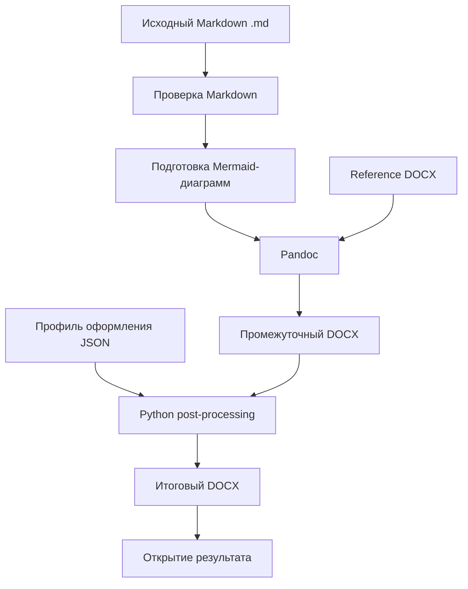

# Техническое задание

## 1 Общие сведения

### 1.1 Наименование системы

Наименование: **локальный инструмент конвертации Markdown-документации в DOCX** (далее — *Система*, *Конвертер*).

Рабочее наименование проекта: `md2gostdocx`.

### 1.2 Назначение системы

Система предназначена для подготовки сдаваемых документов в формате Microsoft Word (`.docx`) на основе исходных файлов Markdown (`.md`), ведущихся в локальных Git-репозиториях и публикуемых на GitHub.

Система должна обеспечивать воспроизводимое преобразование Markdown в DOCX с применением профиля оформления, включая требования к шрифтам, стилям заголовков, таблицам, рисункам, полям страницы и колонтитулам.

### 1.3 Контекст применения

Пользователь разрабатывает техническую, проектную и научно-техническую документацию, в том числе технические задания, ориентированные на требования ГОСТ 19. Исходная документация хранится и просматривается в Markdown; GitHub-рендеринг используется для командного доступа, ревью и обсуждения.

Сдача результатов проектов требует предоставления документов в формате DOCX. Markdown-разметка не должна отображаться в итоговом документе как обычный текст: заголовки, выделения, списки, таблицы и изображения должны становиться нативными объектами DOCX.

### 1.4 Цели доработки

Целями являются:

- сокращение ручного форматирования DOCX после конвертации;
- получение единообразного оформления документов;
- применение Times New Roman размером 12 pt к тексту документа и тексту таблиц;
- автоматическое оформление всех таблиц: ширина рабочей области страницы, чёрные границы толщиной 0,5 pt, форматирование шапки;
- возможность использовать несколько профилей оформления;
- поддержка семантических элементов Markdown, удобных для ТЗ;
- проверка Markdown перед выпуском DOCX;
- сохранение совместимости исходных файлов с GitHub Markdown.

## 2 Границы системы

### 2.1 Входит в состав работ

В состав работ входит:

- развитие графического интерфейса локального приложения;
- запуск Pandoc для преобразования Markdown в DOCX;
- использование reference DOCX как источника стилей;
- постобработка созданного DOCX средствами Python;
- поддержка профилей оформления;
- проверка структуры исходного Markdown;
- контроль ссылок на изображения;
- подготовка Mermaid-диаграмм для включения в DOCX;
- формирование журнала выполнения операции.

### 2.2 Не входит в состав работ первого этапа

На первом этапе не требуется:

- облачное хранение документов;
- коллективное редактирование в приложении;
- полноценный визуальный редактор Markdown;
- автоматическое юридическое подтверждение соответствия ГОСТ;
- двустороннее преобразование DOCX в Markdown с сохранением всей семантики;
- генерация содержательной части ТЗ средствами приложения.

## 3 Архитектура решения

### 3.1 Общая схема



### 3.2 Логическая последовательность сборки

1. Пользователь выбирает исходный файл `.md`.
2. Пользователь выбирает профиль оформления или отдельный reference DOCX.
3. Система проверяет наличие Pandoc и доступность входных файлов.
4. Система выполняет статическую проверку Markdown.
5. При наличии Mermaid-диаграмм система формирует изображения PNG или SVG.
6. Система запускает Pandoc и создаёт промежуточный DOCX.
7. Система выполняет постобработку DOCX с применением настроек профиля.
8. Итоговый DOCX сохраняется рядом с исходным Markdown-файлом, если пользователь не выбрал иной каталог.
9. Система выводит журнал и предлагает открыть созданный документ.

### 3.3 Структура проекта

```text
md2gostdocx/
├── startmydocx.command
├── md_to_docx_gui.py
├── profiles/
│   ├── gost19-times12/
│   │   ├── reference.docx
│   │   ├── profile.json
│   │   └── table_filter.py
│   └── simple/
│       ├── reference.docx
│       └── profile.json
├── filters/
│   └── gost_docx.lua
├── examples/
│   └── example-tz.md
├── output/
└── logs/
```

### 3.4 Назначение компонентов

| Компонент | Назначение |
|---|---|
| `startmydocx.command` | Запуск приложения двойным щелчком в macOS |
| `md_to_docx_gui.py` | Графический интерфейс, запуск сборки, вывод статуса и ошибок |
| `reference.docx` | Стили Word, параметры страницы, колонтитулы, базовое оформление |
| `profile.json` | Машиночитаемые параметры профиля оформления |
| `table_filter.py` | Постобработка таблиц итогового DOCX |
| `gost_docx.lua` | Семантические преобразования Pandoc Markdown |
| `examples/example-tz.md` | Пример корректного исходного документа |
| `output/` | Каталог для результатов, если выбран вывод не рядом с исходником |
| `logs/` | Журналы конвертации и диагностики |

## 4 Функциональные требования

### 4.1 Выбор файлов

Графический интерфейс должен содержать следующие элементы:

| Элемент | Требование |
|---|---|
| Исходный Markdown | Поле пути и кнопка «Выбрать файл…»; выбор через Finder файлов `.md`, `.markdown`, `.mdown`, `.mkdn` |
| Профиль оформления | Выпадающий список доступных профилей |
| Reference DOCX | Поле пути и кнопка «Выбрать файл…»; возможность использовать reference DOCX профиля или указать пользовательский файл |
| Каталог результата | По умолчанию — каталог исходного Markdown; должна быть возможность выбрать иной каталог |
| Имя результата | По умолчанию — имя исходного файла с расширением `.docx` |
| Кнопка сборки | «Создать DOCX» |
| Кнопка проверки | «Проверить Markdown» |
| Журнал | Многострочное поле статуса, предупреждений и ошибок |
| Открытие результата | Настройка «Открыть DOCX после сборки» |

### 4.2 Имена итоговых файлов

По умолчанию итоговый файл должен формироваться рядом с исходным:

```text
Техническое задание.md
Техническое задание.docx
```

Если в YAML-метаданных заданы `document_code` и `version`, система должна поддерживать дополнительный режим именования:

```text
ТЗ-ИС-001-2026_v1.0.docx
```

### 4.3 Профили оформления

Система должна поддерживать не менее следующих профилей:

| Профиль | Назначение |
|---|---|
| ГОСТ 19 — НГУ | Основной профиль технического задания: Times New Roman 12, оформление таблиц, заголовков и страниц |
| Простой DOCX | Базовый профиль без принудительной ГОСТ-стилизации |
| Пользовательский reference DOCX | Сборка с выбранным пользователем DOCX-шаблоном |

Пример файла `profile.json`:

```json
{
  "name": "ГОСТ 19 — НГУ",
  "font": "Times New Roman",
  "font_size_pt": 12,
  "page_size": "A4",
  "table_border_color": "000000",
  "table_border_pt": 0.5,
  "table_width_percent": 100,
  "table_header_bold": true,
  "table_header_center": true,
  "table_allow_autofit": false,
  "open_after_build": true
}
```

### 4.4 Конвертация Markdown

Для базовой конвертации должен использоваться Pandoc.

Минимальный состав параметров Pandoc:

```bash
pandoc "<исходный-файл.md>" \
  --from=gfm \
  --standalone \
  --resource-path="<каталог-исходника>" \
  --reference-doc="<reference.docx>" \
  --output="<итоговый-файл.docx>"
```

Система должна:

- проверять доступность команды `pandoc`;
- показывать пользователю понятное сообщение, если Pandoc отсутствует;
- передавать абсолютные пути к файлам;
- корректно обрабатывать пути с пробелами и русскими символами;
- сообщать о коде ошибки и тексте stderr при неудачной конвертации.

### 4.5 Постобработка DOCX

После формирования Pandoc DOCX система должна открыть документ через Python и применить правила профиля.

#### 4.5.1 Основной текст

Для основного текста должны быть установлены:

- шрифт: Times New Roman;
- размер: 12 pt;
- цвет: чёрный;
- выравнивание: по ширине;
- оформление заголовков в соответствии с reference DOCX.

Должны быть проверены и при необходимости исправлены стили:

- `Normal` / «Обычный»;
- `Heading 1` / «Заголовок 1»;
- `Heading 2` / «Заголовок 2»;
- `Heading 3` / «Заголовок 3»;
- стили списков;
- стили подписей;
- стили текста в таблицах.

#### 4.5.2 Таблицы

Для каждой таблицы итогового DOCX должны быть выполнены правила:

| Параметр | Требование |
|---|---|
| Ширина таблицы | 100% доступной ширины между полями страницы |
| Автоподбор | Отключён; таблица не должна сжиматься до ширины содержимого |
| Границы | Все внешние и внутренние границы чёрного цвета |
| Толщина границ | 0,5 pt |
| Шрифт в ячейках | Times New Roman, 12 pt |
| Шапка таблицы | Полужирное начертание; выравнивание по центру |
| Вертикальное выравнивание | По центру ячейки, если не задано иное профилем |
| Разрыв страниц | Строка шапки не должна разделяться между страницами |
| Выравнивание таблицы | По центру рабочей области страницы |

Для реализации необходимо использовать `python-docx` и, при необходимости, низкоуровневое редактирование OpenXML, так как не все параметры Word-таблиц доступны через публичный API библиотеки.

### 4.6 Рисунки

Система должна поддерживать Markdown-изображения:

```markdown

```

Дополнительно допускается расширенный синтаксис Pandoc:

```markdown
{width=90%}
```

Требования:

- проверять существование файлов изображений по относительным путям;
- выводить предупреждение при отсутствии изображения;
- поддерживать режим «вписывать в рабочую ширину страницы»;
- сохранять подпись рисунка в DOCX;
- не нарушать отображение стандартного Markdown в GitHub.

### 4.7 Mermaid-диаграммы

Система должна распознавать Mermaid-блоки:

````markdown

````

Для DOCX Mermaid-диаграммы должны преобразовываться в PNG или SVG до запуска Pandoc либо в составе отдельного этапа сборки.

Требования:

- исходный Mermaid-код должен сохраняться в Markdown для корректного отображения на GitHub;
- DOCX должен содержать готовое изображение, а не Mermaid-код;
- ошибка рендеринга Mermaid должна отображаться в журнале;
- в первом этапе допускается предупреждение и требование ручного экспорта диаграммы;
- в последующем этапе должна быть предусмотрена интеграция с Mermaid CLI.

### 4.8 Проверка Markdown

Перед сборкой должна быть доступна отдельная операция «Проверить Markdown».

Проверка должна выдавать ошибки и предупреждения по следующим категориям:

| Проверка | Уровень | Пример сообщения |
|---|---|---|
| Отсутствует файл изображения | Ошибка | `images/context.png` не найден |
| Mermaid-блок не обработан | Предупреждение | Mermaid будет исключён из DOCX без этапа рендеринга |
| Отсутствует заголовок H1 | Предупреждение | Не найден раздел верхнего уровня `#` |
| Нарушена иерархия заголовков | Предупреждение | После H1 обнаружен H3 без H2 |
| Не заполнен `title` | Предупреждение | В YAML-метаданных отсутствует поле `title` |
| Некорректная таблица | Предупреждение | Строки таблицы содержат разное число ячеек |
| Длинная неразрывная строка | Предупреждение | Возможен выход текста за границы таблицы |
| Отсутствует Pandoc | Ошибка | Не найдена команда `pandoc` |

### 4.9 Журналирование

Система должна выводить журнал процесса, содержащий:

- дату и время запуска;
- путь к исходному Markdown;
- путь к reference DOCX;
- выбранный профиль;
- путь к итоговому DOCX;
- результаты проверки Markdown;
- команду Pandoc без чувствительных данных;
- предупреждения и ошибки;
- итоговый статус: «успешно», «успешно с предупреждениями», «ошибка».

## 5 Поддерживаемый Markdown

### 5.1 YAML-метаданные

В начале документа допускается YAML-блок:

```markdown
---
title: "Техническое задание"
document_code: "ТЗ-ИС-001-2026"
version: "1.0"
date: "06.09.2026"
customer: "НГУ"
developer: "Наименование исполнителя"
---
```

Требования:

- метаданные не должны ухудшать отображение документа в GitHub;
- `title`, `document_code`, `version`, `date`, `customer`, `developer` должны быть доступны для формирования имени, титульного листа и колонтитулов в последующих версиях;
- отсутствие необязательных полей не должно останавливать сборку;
- отсутствие `title` должно создавать предупреждение.

### 5.2 Заголовки

Для структуры документа используются стандартные заголовки Markdown:

```markdown
# 1 ОБЩИЕ ПОЛОЖЕНИЯ

## 1.1 Наименование системы

### 1.1.1 Полное наименование
```

Требования:

- заголовки должны преобразовываться в нативные стили Word `Heading 1–3`;
- ручное выделение заголовков `**жирным**` не должно требоваться;
- нумерация может задаваться исходным Markdown либо стилями Word в зависимости от выбранного профиля;
- поддерживается не менее трёх уровней заголовков.

### 5.3 Обычный текст и выделение

Поддерживаются стандартные элементы GitHub Flavored Markdown:

```markdown
**Полужирное выделение**

*Курсивное выделение*

~~Зачёркнутый текст~~

[Ссылка на документ](https://example.org)
```

В DOCX эти элементы должны преобразовываться в нативное форматирование Word, без сохранения символов `**`, `*`, `~~`, `[]` и `()` как текста разметки.

### 5.4 Списки

Поддерживаются маркированные и нумерованные списки:

```markdown
- Требование первое
- Требование второе

1. Этап подготовки
2. Этап испытаний
3. Этап сдачи
```

Списки должны отображаться как нативные списки Word и использовать шрифт профиля.

### 5.5 Базовые таблицы

Базовая таблица требований оформляется так:

```markdown
| № | Требование | Содержание требования |
|---:|---|---|
| 1 | Производительность | Не менее 100 одновременных пользователей |
| 2 | Аутентификация | Интеграция с корпоративной учётной записью |
| 3 | Журналирование | Регистрация операций и ошибок |
```

Правила оформления таблицы определяются профилем и постобработкой DOCX.

### 5.6 Смысловые блоки

Для последующих версий поддерживаются fenced Divs Pandoc Markdown:

```markdown
::: {custom-style="Requirement"}
Система должна обеспечивать хранение журнала событий не менее 12 месяцев.
:::

::: {custom-style="Note"}
Допускается уточнение состава интеграций на этапе технического проектирования.
:::

::: {custom-style="Warning"}
Перед вводом в эксплуатацию требуется провести приёмочные испытания.
:::
```

В reference DOCX должны быть определены стили `Requirement`, `Note`, `Warning`.

На первом этапе система должна корректно пропускать такие блоки через Pandoc. Визуальное выделение блоков допускается внедрять после стабилизации базовой конвертации.

### 5.7 Таблицы разных типов

Для дальнейшего развития допускается применение классов к специализированным таблицам:

```markdown
::: {custom-style="RequirementsTable"}
| № | Требование | Критерий приёмки |
|---:|---|---|
| 1 | Авторизация | Пользователь входит через SSO |
| 2 | Журналирование | Операции доступны аудитору |
:::
```

```markdown
::: {custom-style="TermsTable"}
| Термин | Определение |
|---|---|
| Пользователь | Лицо, использующее систему |
| Администратор | Пользователь с правами настройки |
:::
```

## 6 Требования к оформлению DOCX

### 6.1 Общие параметры

Профиль «ГОСТ 19 — НГУ» должен содержать по умолчанию:

| Параметр | Значение |
|---|---|
| Формат бумаги | A4 |
| Основной шрифт | Times New Roman |
| Размер основного шрифта | 12 pt |
| Цвет текста | Чёрный |
| Выравнивание обычного текста | По ширине |
| Оформление заголовков | Стили `Heading 1–3` из reference DOCX |
| Колонтитулы | По reference DOCX |
| Нумерация страниц | По reference DOCX |

Точные размеры полей, отступ первой строки, интервал и особенности титульного листа должны быть параметризованы профилем и уточняться для конкретного заказчика или методики.

### 6.2 Принцип приоритета оформления

При конфликте настроек применяется следующий порядок:

1. Принудительные правила post-processing из активного профиля.
2. Стили и свойства выбранного reference DOCX.
3. Разметка и атрибуты исходного Markdown.
4. Стандартные значения Pandoc.

Это означает, что пользовательский reference DOCX задаёт исходное оформление, но профиль может принудительно исправлять шрифт, таблицы и параметры страницы для стабильности результата.

## 7 Требования к интерфейсу

### 7.1 Экран основного окна

Макет основного окна:

```text
Markdown → DOCX (ГОСТ-профили)

Исходный Markdown:  [ /путь/к/ТЗ.md                         ] [Выбрать…]
Профиль:            [ ГОСТ 19 — НГУ, Times New Roman 12  ▼ ]

☑ Использовать reference DOCX из профиля
Reference DOCX:     [ /путь/к/reference.docx                ] [Выбрать…]

Результат:          ◉ Рядом с исходным Markdown
                    ○ Указать папку: [ /путь/к/папке        ] [Выбрать…]

☑ Принудительно оформить таблицы
☑ Проверить Markdown перед сборкой
☑ Открыть DOCX после сборки

[Проверить Markdown] [Создать DOCX] [Открыть папку результата]

Журнал:
[ .................................................................... ]
[ .................................................................... ]
```

### 7.2 Поведение интерфейса

- При выборе исходного Markdown система должна запоминать последний каталог.
- При выборе профиля система должна автоматически подставлять reference DOCX профиля.
- При отключении флажка «Использовать reference DOCX из профиля» пользователь должен иметь возможность выбрать отдельный DOCX-файл.
- При существовании итогового файла система должна запрашивать подтверждение замены.
- После успешной сборки система должна показать полный путь к результату.
- При выборе «Открыть DOCX после сборки» система должна открыть итоговый файл стандартным приложением macOS.
- Все критичные ошибки должны отображаться как диалоговое сообщение и дублироваться в журнале.

## 8 Нефункциональные требования

### 8.1 Платформа

- Основная платформа: macOS на Apple Silicon, включая MacBook с процессором M2.
- Запуск: двойным щелчком по `startmydocx.command` или запуском Python-скрипта.
- Python: версия, доступная через `python3` в macOS.
- Pandoc: установлен через Homebrew или альтернативным способом.

### 8.2 Автономность и конфиденциальность

- Конвертация Markdown в DOCX должна выполняться локально.
- Исходные документы и итоговые DOCX не должны передаваться во внешние сервисы.
- Подключение к сети допускается только при явно включённой пользователем операции работы с GitHub или установки зависимостей.

### 8.3 Повторяемость

При одинаковых входных данных, одинаковом профиле, версии Pandoc и версии reference DOCX система должна формировать сопоставимый по структуре и оформлению DOCX.

### 8.4 Совместимость

- Исходный Markdown должен оставаться читаемым и корректно отображаться в GitHub.
- DOCX должен открываться в Microsoft Word, Google Docs и LibreOffice с допустимыми различиями отображения.
- Основной ориентир качества итогового оформления — Microsoft Word и требования сдающей стороны.

## 9 Этапы реализации

### 9.1 Этап 1: устойчивый базовый конвертер

В рамках этапа реализовать:

- выбор Markdown-файла;
- выбор reference DOCX;
- создание DOCX рядом с исходником;
- обработку ошибок Pandoc;
- сохранение последнего выбранного шаблона;
- кнопку открытия папки результата;
- журнал конвертации;
- проверку наличия Pandoc.

Результат этапа: пользователь может без Terminal выбрать `.md` и reference DOCX, нажать кнопку и получить DOCX.

### 9.2 Этап 2: профиль «ГОСТ 19 — НГУ» и таблицы

В рамках этапа реализовать:

- профиль JSON;
- принудительную установку Times New Roman 12;
- настройку стилей основного текста и заголовков;
- постобработку всех таблиц;
- ширину таблиц по рабочей области страницы;
- чёрные границы 0,5 pt;
- форматирование шапок таблиц;
- отключение сжатия таблиц до ширины содержимого.

Результат этапа: DOCX не требует ручной корректировки шрифта и базового оформления таблиц в типовых случаях.

### 9.3 Этап 3: валидатор Markdown

В рамках этапа реализовать:

- проверку YAML-метаданных;
- проверку структуры заголовков;
- проверку изображений;
- проверку Markdown-таблиц;
- предупреждения для Mermaid;
- вывод диагностического отчёта до сборки.

Результат этапа: пользователь получает сообщения о проблемах до формирования DOCX.

### 9.4 Этап 4: Mermaid и интеграция с репозиторием

В рамках этапа реализовать:

- поддержку Mermaid CLI;
- генерацию PNG/SVG для DOCX;
- сохранение исходного Mermaid-кода для GitHub;
- опциональную кнопку «Собрать из локального репозитория»;
- последовательность `git pull → проверка → рендер диаграмм → сборка DOCX`.

Результат этапа: архитектурные схемы из Markdown автоматически включаются в DOCX как изображения.

## 10 Приёмочные критерии

Система считается соответствующей ТЗ, если выполнены следующие проверки.

| № | Проверка | Ожидаемый результат |
|---:|---|---|
| 1 | Выбрать `.md` через Finder | Путь появляется в поле исходного Markdown |
| 2 | Выбрать reference DOCX через Finder | Путь появляется в поле шаблона |
| 3 | Нажать «Создать DOCX» | DOCX создан без необходимости вводить команду в Terminal |
| 4 | Исходный файл `ТЗ.md` | По умолчанию создаётся `ТЗ.docx` рядом с ним |
| 5 | Обычный текст Markdown | В DOCX отображается Times New Roman, 12 pt |
| 6 | Заголовки `#`, `##`, `###` | В DOCX имеют нативные стили заголовков Word |
| 7 | Markdown-выделение `**текст**` | В DOCX создаётся полужирное начертание без символов `**` |
| 8 | Markdown-таблица | В DOCX является редактируемой таблицей Word |
| 9 | Таблица с коротким содержимым | Растянута по рабочей ширине страницы, а не сжата по содержимому |
| 10 | Границы таблицы | Все границы чёрные, толщиной 0,5 pt |
| 11 | Текст в таблицах | Times New Roman, 12 pt |
| 12 | Отсутствующее изображение | До сборки выводится понятное сообщение об ошибке |
| 13 | Mermaid-блок | Выводится предупреждение или создаётся изображение после реализации этапа 4 |
| 14 | Повторная сборка | Пользователь получает запрос на замену существующего DOCX |
| 15 | Ошибка Pandoc | В интерфейсе отображается понятное сообщение и текст ошибки |

## 11 Риски и ограничения

- Google Docs может упрощать стили DOCX при импорте и экспорте; поэтому reference DOCX не следует считать единственным механизмом гарантированного оформления.
- Часть параметров Word-таблиц недоступна в высокоуровневом API `python-docx`; для точного управления шириной, автоподбором и границами может потребоваться OpenXML.
- Mermaid не исполняется в DOCX как JavaScript; диаграммы должны быть предварительно превращены в изображения.
- Сложные таблицы с объединением ячеек, нестандартной вёрсткой и особыми разрывами страниц могут требовать отдельных правил или финальной визуальной проверки.
- Соответствие ГОСТ зависит не только от шрифта и таблиц, но и от требований конкретного заказчика, организации и вида документа.

## 12 Рекомендуемый результат первой версии

Первую рабочую версию рекомендуется ограничить следующим набором:

1. Локальный GUI для macOS.
2. Выбор `.md` и `reference.docx` через Finder.
3. Pandoc-конвертация Markdown в DOCX.
4. Итоговый DOCX рядом с исходным Markdown.
5. Встроенный профиль «ГОСТ 19 — Times New Roman 12».
6. Принудительная обработка таблиц: ширина рабочей области, границы 0,5 pt, Times New Roman 12, шапка таблицы.
7. Проверка наличия Pandoc, входных файлов и изображений.
8. Журнал и понятные сообщения об ошибках.

После стабилизации этой версии рекомендуется добавить YAML-метаданные, проверки Markdown, Mermaid-рендеринг и специализированные семантические блоки `Requirement`, `Note`, `Warning`.
